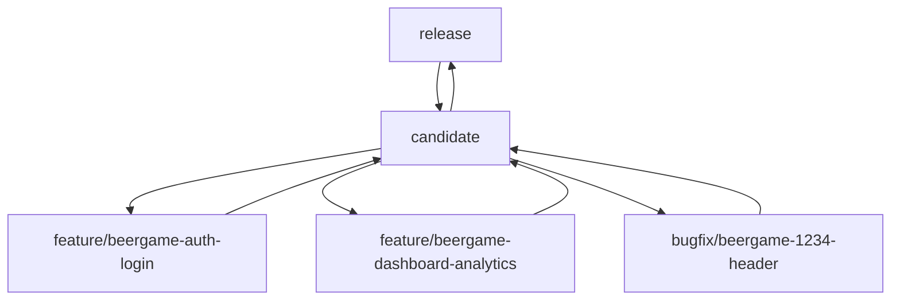

# Branching Methodology

## Overview
This document outlines our Git branching strategy, designed to support a structured development workflow with clear separation between production, testing, and development work.

## Branch Types

| Branch | Purpose | Notes |
|--------|---------|--------|
| `release` | Production branch for candidate releases that pass integration testing. | Production-ready code only |
| `candidate` | QA pulls all features here for integration testing. | Testing and validation |
| `feature` | Each developer creates a new branch off the candidate branch for individual features or UI components. | Format: `feature/<project>-<page-section>-<description>` e.g., `feature/beergame-auth-login` |
| `bugfix` | Like feature branches but specifically for bug fixes. They branch off the candidate branch. | Format: `bugfix/<project>-<issue-id>-<description>` e.g., `bugfix/beergame-1234-header` |

## Branch Flow

## Branch Naming Conventions

### Feature Branches
- Pattern: `feature/<project>-<page-section>-<description>`
- Examples:
  - `feature/beergame-auth-login`
  - `feature/beergame-dashboard-analytics`
  - `feature/survey-profile-settings`

### Bugfix Branches
- Pattern: `bugfix/<project>-<issue-id>-<description>`
- Examples:
  - `bugfix/beergame-1234-header`
  - `bugfix/survey-5678-validation`
  - `bugfix/beergame-9012-style`

### Documentation Branches
- Pattern: `docs/<project>-<description>`
- Examples:
  - `docs/beergame-api-documentation`
  - `docs/survey-setup-guide`

### Refactor Branches
- Pattern: `refactor/<project>-<description>`
- Examples:
  - `refactor/beergame-auth-cleanup`
  - `refactor/survey-api-restructure`

## Branch Lifecycle

1. **Development**
   - Create branch from `candidate`
   - Develop and test locally
   - Push changes and create PR

2. **Review**
   - PR reviewed by team
   - Changes requested or approved

3. **Integration**
   - Merge into `candidate`
   - Integration testing performed

4. **Release**
   - Merge tested code into `release`
   - Deploy to production

## Best Practices

1. **Branch Creation**
   - Always create from latest `candidate`
   - Use correct naming convention
   - One feature/fix per branch

2. **During Development**
   - Regular commits with clear messages
   - Keep branches up to date with `candidate`
   - Local testing before push

3. **Before Merge**
   - Resolve conflicts with `candidate`
   - Ensure all tests pass
   - Get required approvals

4. **After Merge**
   - Delete merged feature/bugfix branches
   - Verify changes in `candidate`
   - Update related tickets